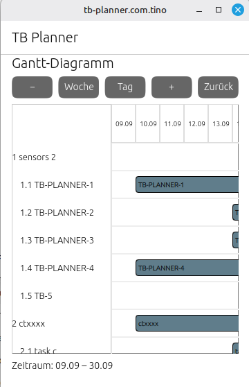

# TB Planner UT

TB Planner UT is the Ubuntu Touch version of **TB Planner**, a hierarchical
WBS/Gantt project planning application.

The application is designed as a standalone planner for Ubuntu Touch and uses
the same task model and calendar-based data structure as the Thunderbird
version of TB Planner.

The long-term goal is to use the same QML/Python application architecture
across multiple platforms.

---

## Project Status

**Current status: functional prototype / active development**

The basic planner functionality is working:

- hierarchical task list
- WBS numbering
- parent/child relationships
- task ordering
- task start date
- task duration
- task due date
- Gantt chart
- CalDAV calendar synchronization
- VTODO import/export
- synchronization of local tasks with a CalDAV calendar
- creation of new VTODOs
- updating existing VTODOs
- deletion of VTODOs
- tasks without start/end dates remain visible in the task list

The current implementation is primarily intended for Ubuntu Touch.

---

## Relationship to TB Planner

`tb-planner-ut` is the Ubuntu Touch implementation of the existing
Thunderbird add-on **TB Planner**.

The Thunderbird version integrates directly into Thunderbird and uses the
Thunderbird Calendar API.

The Ubuntu Touch version is a standalone application and does not depend on
Thunderbird.

Both applications use the same conceptual task structure:

    Task
     ├── UID
     ├── Summary
     ├── Start date
     ├── Due date
     ├── Duration
     ├── WBS
     ├── Parent
     └── Order

Tasks are stored as iCalendar `VTODO` objects.

---

## Architecture

The application uses a QML/Python architecture.

    +-----------------------------+
    |            QML              |
    |                             |
    |  User Interface             |
    |  Task List                  |
    |  WBS                        |
    |  Gantt Chart                |
    +-------------+---------------+
                  |
                  v
    +-----------------------------+
    |           Python            |
    |                             |
    |  PlannerTask                |
    |  CalDAV communication       |
    |  VTODO parsing/generation   |
    |  Synchronization            |
    +-------------+---------------+
                  |
                  v
    +-----------------------------+
    |          CalDAV             |
    |                             |
    |        VTODO tasks          |
    +-----------------------------+

The internal Python task representation is based on `PlannerTask`.

Important fields include:

    uid
    summary
    description
    status
    percent_complete
    dtstart
    due
    wbs
    parent
    order

---

## VTODO Format

TB Planner uses iCalendar `VTODO` objects.

In addition to standard VTODO properties, TB Planner stores planning
information using custom properties:

    X-TB-PLANNER-WBS
    X-TB-PLANNER-PARENT
    X-TB-PLANNER-ORDER

A simplified VTODO looks like:

    BEGIN:VCALENDAR
    PRODID:-//TB Planner//EN
    VERSION:2.0
    BEGIN:VTODO
    UID:...
    DTSTAMP:...
    SUMMARY:Example task
    STATUS:NEEDS-ACTION
    PERCENT-COMPLETE:0
    DTSTART;VALUE=DATE:20260914
    DUE;VALUE=DATE:20260923
    X-TB-PLANNER-WBS:1.1
    X-TB-PLANNER-PARENT:...
    X-TB-PLANNER-ORDER:1
    END:VTODO
    END:VCALENDAR

This allows the same calendar data to be used by different TB Planner
implementations.

---

## Task Hierarchy

Tasks are organized hierarchically.

Example:

    1    sensors 2
    1.1  TB-PLANNER-1
    1.2  TB-PLANNER-2
    1.3  TB-PLANNER-3

    2    ctxxxx
    2.1  task c
    2.2  Task b
    2.3  TB-PLANNER-CALTODO-TEST

    3    Test it now
    3.1  task a

The WBS number is generated from the task hierarchy.

The parent task is stored using its UID.

The order of the local task list determines the order stored by the planner.

---

## Synchronization

Synchronization is performed between the local task model and a CalDAV
calendar.

The synchronization process is approximately:

    Local task list
          |
          v
    Calculate WBS / parent / order
          |
          v
    Read current CalDAV VTODOs
          |
          v
    Match tasks by UID
          |
          +----------------------+
          |                      |
          v                      v
    Existing task            New task
          |                      |
          v                      v
    Update VTODO              Create VTODO
          |
          v
    CalDAV calendar

Existing tasks are identified by their UID.

For existing tasks, the planner updates:

- summary
- start date
- due date
- WBS
- parent
- order

The due date is calculated from the start date and duration.

For a duration of `N` days:

    due = start + (N - 1) days

Example:

    Start:    2026-09-14
    Duration: 10 days
    Due:      2026-09-23

---

## Tasks Without Dates

A VTODO does not necessarily have to contain a start or due date.

Such tasks are still valid planner tasks.

TB Planner UT therefore keeps them in the task list.

The Gantt chart handles them separately:

    Task list
        |
        +-- task with dates
        |      -> Gantt bar
        |
        +-- task without dates
               -> task remains visible
               -> no Gantt bar

The Gantt time range is calculated only from tasks which have a complete
start/end range.

---

## Gantt Chart

The Gantt view displays tasks which have a valid date range.

The time axis is calculated dynamically from the dated tasks.

Tasks without a complete date range remain visible in the task list but do not
produce a Gantt bar.

This allows project structures to contain tasks which have not yet been
scheduled.

---

## CalDAV

TB Planner UT communicates with a CalDAV server.

The Python backend handles:

- calendar access
- VTODO retrieval
- VTODO parsing
- VTODO creation
- VTODO updates
- VTODO deletion

The calendar URL and credentials are supplied to the Python backend by the
application.

**Do not commit real calendar credentials to the repository.**

---

## Project Structure

The project is structured approximately as follows:

    tb-planner-ut/
    │
    ├── qml/
    │   ├── ...
    │   └── ...
    │
    ├── python/
    │   ├── planner.py
    │   └── caldav/
    │       └── ical.py
    │
    ├── ...
    └── README.md

The exact QML structure may change during development.

The important separation is:

    QML
      |
      +-- user interface
      |
    Python
      |
      +-- task model
      +-- synchronization
      +-- CalDAV
      +-- iCalendar/VTODO

---

## Development

The project is developed on Linux and tested primarily with Ubuntu Touch
development tools.

The Python backend can also be tested independently.

The backend communicates through JSON requests.

Supported operations include:

    list
    create
    update
    delete
    sync

The `sync` operation receives the local task list and synchronizes it with
the configured CalDAV calendar.

---

## JSON Synchronization Model

A task sent to the Python backend contains fields such as:

    {
      "uid": "...",
      "summary": "Example task",
      "level": 1,
      "duration": 5,
      "dtstart": "20260914",
      "due": "20260918",
      "wbs": "1.1",
      "parent": "...",
      "order": 1
    }

The `level` field describes the hierarchy level.

The WBS and parent information are calculated during synchronization.

---

## Platform Strategy

The Ubuntu Touch application is part of a larger effort to create a
platform-independent TB Planner implementation.

The intended architecture is:

                  TB Planner
                      |
            +---------+---------+
            |         |         |
            v         v         v
       Ubuntu Touch  Linux    Windows
                     Desktop

The preferred common technology is:

    QML + Python

This should make it possible to reuse most of the application logic and
user interface across platforms.

Potential future targets include:

- Ubuntu Touch
- postmarketOS
- Linux Mint
- other Linux desktop systems
- Windows

The Thunderbird add-on remains a separate implementation because it depends
on Thunderbird's extension and Calendar APIs.

---

## Current Development Goals

The project is currently focused on:

1. stable CalDAV synchronization
2. reliable VTODO handling
3. task hierarchy and WBS handling
4. Gantt visualization
5. task editing
6. Ubuntu Touch user interface
7. separation of platform-independent Python logic from the UI

Later development can focus on:

- improved task editing
- project/task creation dialogs
- better mobile interaction
- dependency handling
- project filtering
- task completion handling
- desktop packaging
- support for additional platforms

---

## Related Project

Thunderbird version:

**TB Planner**

The Thunderbird version provides the same basic planning concept as a
Thunderbird extension.

TB Planner UT provides the same project data model without requiring
Thunderbird.

---

## License

See the project license file.

---

## Development Notes

This project is under active development.

The data model and synchronization protocol are intended to remain compatible
with the TB Planner Thunderbird implementation wherever practical.

Changes to the VTODO format or custom `X-TB-PLANNER-*` properties should
therefore be made carefully to avoid breaking synchronization between the
different TB Planner implementations.
